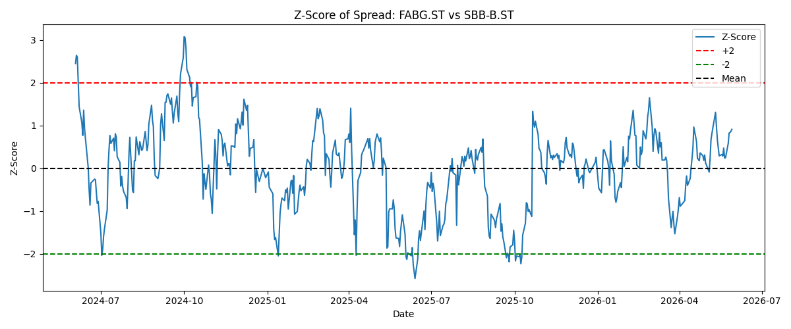

# Pairs Trading Screener

A python project that uses historical stock price data from Yahoo Finance to identify potentially cointegrated stock pairs and generate basic pairs trading signals.

## What is Pairs Trading?

Pairs trading is a strategy that looks for two stocks that historically move together. If the relationship between the stocks temporarily deviates from its historical norm, a trader may bet that the relationship will eventually return to normal.

Not all stocks are suitable for pairs trading. Stocks from the same industry or sector often share similar economic drivers and are therefore more likely to move together over time. In this project, Swedish real estate companies are used as examples because they are exposed to many of the same market factors, such as interest rates and property market conditions.

This script:

* Downloads historical stock prices using the Yahoo Finance API (`yfinance`)
* Tests stock pairs for cointegration using `statsmodels`
* Identifies pairs with a p-value below 0.05
* Calculates beta, spread, and z-score for the strongest pair
* Generates a simple buy/sell signal based on the z-score

Cointegration is used to identify stock pairs that have historically maintained a stable long-term relationship, making them potential candidates for pairs trading.

## Trading signals

```text
z-score > 2
→ Short stock1, Long stock2

z-score < -2
→ Long stock1, Short stock2

-2 < z-score < 2
→ No signal
```

## Customizing the stocks

The script currently uses a list of Swedish real estate companies, but any stock tickers supported by Yahoo Finance can be used by modifying the `tickers` list.

## Technologies

* Python
* NumPy
* Statsmodels
* Yahoo Finance API (`yfinance`)
* Matplotlib
* Seaborn

## Run the project

```bash (in the terminal)
pip install numpy statsmodels yfinance matplotlib seaborn
python3 Pairs_Trading.py
```


## Example Output

The figure below shows the z-score of the spread for the strongest cointegrated stock pair identified by the script.

<br>




## Disclaimer

This project was created for educational and portfolio purposes. It demonstrates the use of Python, APIs, statistical analysis, and data visualization to identify potential pairs trading opportunities. It is not intended to be used as a complete trading strategy or as investment advice.
